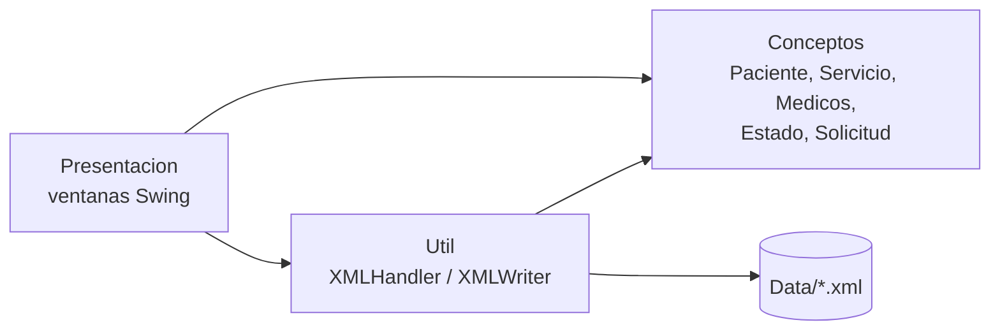

# Clinica-Odonto-POO

<p align="center">
  
</p>

<h1 align="center">Clínica Odontológica Molares</h1>

Aplicación de escritorio en Java, desarrollada en NetBeans para gestionar las solicitudes de atención de una clínica odontológica: registrar pacientes, servicios y médicos, crear solicitudes, atenderlas y consultarlas. Hecha para el curso Programación Orientada a Objetos (POO).

<p align="center">
  
  
  
  
</p>

---

## Tabla de Contenidos
- [Features](#features)
- [Autores](#autores)
- [Arquitectura](#arquitectura)
- [Tecnologías](#tecnologías)
- [Estructura del Proyecto](#estructura-del-proyecto)
- [Ejecucion](#ejecucion)
- [Acquired Knowledge](#acquired-knowledge)

---

## Features
* **Crear solicitud:** se elige un paciente y un servicio, se indica la fecha con un calendario y las observaciones. La solicitud nace con el estado *Nuevo* y sin médico asignado.
* **Atender solicitud:** se cambia el estado, se asigna un médico, se actualizan las observaciones y se agregan servicios adicionales.
* **Consultar solicitudes:** búsqueda por paciente, ID de solicitud, nombre, correo, teléfono, servicio, especialidad y fechas, con los resultados en una tabla.
* **Mantenimientos (CRUD)** de pacientes, servicios y médicos, incluyendo los servicios que ofrece cada médico.
* **Estados de una solicitud:** Nuevo, En Revisión, Pendiente de Resultados, Cancelado y Completado.
* Validación de los datos antes de guardar (campos completos, y que el paciente, el servicio, el médico y el estado existan).
* Los datos se guardan en archivos XML, así que no se necesita una base de datos.

---

## Autores
* Christopher Daniel Vargas Villalta, 2024108443
* Jervis Fabricio Esquivel Solano

**Curso:** Programación Orientada a Objetos

---

## Arquitectura
Aplicación en tres paquetes: las clases del dominio (`Conceptos`), la interfaz gráfica (`Presentacion`) y la lectura y escritura de XML (`Util`). La ventana principal se abre desde `Aplicacion.Main`.



* **Conceptos:** clases `Paciente`, `Servicio`, `Medicos`, `Estado` y `Solicitud`. Una `Solicitud` se compone de un paciente, un servicio, un médico, un estado y una lista de servicios adicionales.
* **Presentacion:** formularios `Principal`, `CrearSolicitud`, `Atender`, `Consultar`, `Pacientes`, `Servicios`, `Medico` y `ServiciosValidados`.
* **Util:** `XMLHandler` (lectura) y `XMLWriter` (agregar, modificar y eliminar), ambos con el parser **DOM**. La razón de elegir DOM está explicada en [`Razon del Uso de DOM..txt`](Proyecto_POO_I/src/Util/Razon%20del%20Uso%20de%20DOM..txt).

---

## Tecnologías
* Java 21 con NetBeans (proyecto Ant).
* Java Swing para la interfaz gráfica.
* Parser DOM de XML (`javax.xml.parsers`) para guardar y leer los datos.
* [JCalendar 1.4](https://toedter.com/jcalendar/) (`JDateChooser`) para seleccionar fechas.

---

## Estructura del Proyecto
```text
Proyecto-POO-I/
└── Proyecto_POO_I/
    ├── src/
    │   ├── Aplicacion/Main.java     # Punto de entrada
    │   ├── Conceptos/               # Clases del dominio
    │   ├── Presentacion/            # Ventanas Swing (.java y .form)
    │   └── Util/                    # XMLHandler y XMLWriter
    ├── Data/                        # Archivos XML con los datos
    │   ├── pacientes.xml
    │   ├── servicios.xml
    │   ├── medicos.xml
    │   ├── estados.xml
    │   └── solicitudes.xml
    ├── Diagramas/                   # Casos de uso y diagramas de clases (draw.io)
    ├── Imagenes/logo.jpg            # Logo de la clínica
    └── build.xml, nbproject/        # Configuración de NetBeans
```

Los diagramas en `Diagramas/` (casos de uso UML y diagramas de clases de los proyectos 1 y 2) se abren con [draw.io](https://app.diagrams.net/).

---

## Ejecucion

### Requisitos previos
* JDK 21
* NetBeans (con soporte para proyectos Java con Ant)
* El archivo `jcalendar-1.4.jar`, que no está en el repositorio

### Inicio rápido
1. Clonar el repositorio y abrir la carpeta `Proyecto_POO_I` como proyecto en NetBeans.
2. Descargar `jcalendar-1.4.jar` y agregarlo en *clic derecho en el proyecto → Properties → Libraries → Add JAR/Folder*. El proyecto trae configurada una ruta de la computadora de uno de los autores, así que hay que reemplazarla.
3. Ejecutar el proyecto con **F6** (clase principal `Aplicacion.Main`).

### Notas
* Los archivos `Data/*.xml` y `Imagenes/logo.jpg` se leen con rutas relativas, así que el programa debe ejecutarse con la carpeta `Proyecto_POO_I` como directorio de trabajo, que es lo que hace NetBeans por defecto.
* La aplicación modifica los archivos de `Data/` cuando se crean o atienden solicitudes, o se editan pacientes, servicios y médicos.

---

## Qué Aprendí
* A modelar un problema real con clases y relaciones (composición entre `Solicitud`, `Paciente`, `Servicio`, `Medicos` y `Estado`) y a documentarlo con diagramas UML.
* A separar el código en capas (dominio, interfaz y persistencia) para que los cambios en una no rompan las otras.
* A leer y escribir XML con el parser DOM y a mantener los datos consistentes al agregar, modificar y eliminar.
* A construir una interfaz con Swing y a validar lo que escribe el usuario antes de guardarlo.
